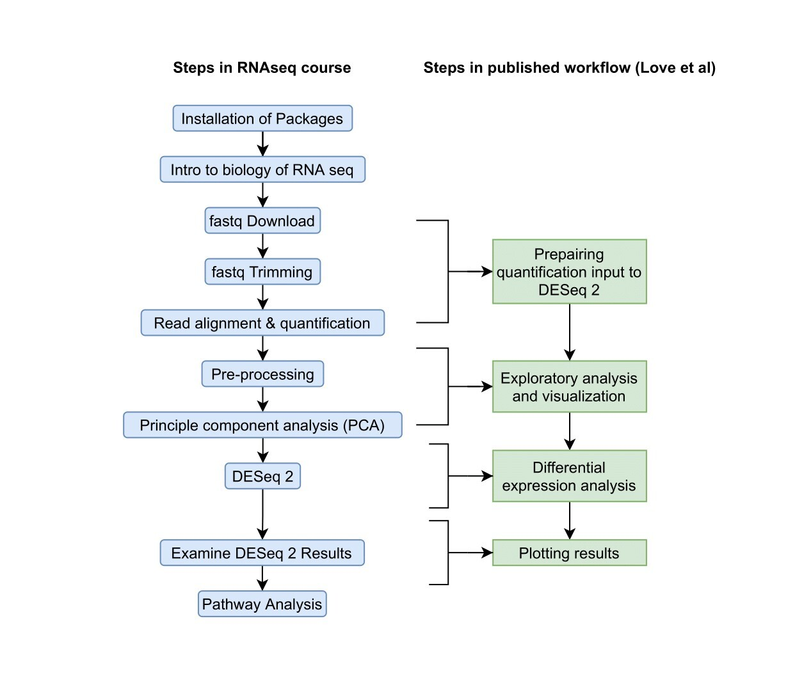

## Accreditation

Adapted from the following resources:

-   Data Wrangling workshop for the BC Children's Trainee Omics Group (TOG) by Almas Khan
-   Also Adapted from Tutorials of Victor Yuan for the BC Children's TOG.
-   [Perdue's Intro to R](https://www.stat.purdue.edu/bigtap/online/docs/Introduction_to_R_and_Bioconductor.html)
## About

- Authors of this script: Almas Khan and Julia Phillip

- Visit BiocSwirl's Twitter page for more updates on our project. 

## Setup

-   Please have the latest version of R and Rstudio installed.

-   Download the [r markdown file]() for this workshop and open it in Rstudio.

-   Install the following R packages now, if you haven't already:


```r
install.packages(c("Bioconductor","swirl"))
### Add swirl Installation
```

## Overall Learning outcomes

-   Knowledge of R and Bioconductor

-   Knowledge of basic R data types

-   Differentiate a matrix and data.frame

-   Understanding how to :

    -   Assign variables
    -   Run built in operations in R
    -   Subset on a data.frame and matrix

<!---The following chunk allows errors when knitting--->


## Additional Resources:

-   [R Swirl](https://swirlstats.com/) for interactive lesson on programming with R
-   [R for data science](http://r4ds.had.co.nz/) : A comprehensive introductory ebook on R. 
-   [Learnr package](https://rstudio.github.io/learnr/) another interactive lesson within R on programming


## Topics

## Part 1: Intro to R:

**What is R?**

-   What are vectors?

    -   Basic data types

-   `data.frame` and `matrix` objects

    -   Basic functions for exploring dataframes
    -   Basic functions for matrices
    -   Indexing and Subsetting

-   Common R operations

-   Variables

### Part 2: Bioconductor and RNAseq

**What is Bioconductor?**

-   Introduction

**What is BiocSwirl**

-   Introduction
-   Notes and topics

## What is R and what is R markdownn? 

- R is an open sourced statistical programming language based on an older propietary language known as S. 
- R contains various add ons known as packages. Think of these like additional apps on that you download onto your phone.  
- We will go over the basics of syntax within R. 

But first, let's talk about the document we are currently working in. Think of it as a like a notebook for your code that includes comments and I find it's easier to keep track of your analysis.

I recommend using **r markdown files** for all of your analysis scripts. 

In `.rmd` files, code needs to be in code chunks (insert code chunk shortcut is Windows: `ctrl` `+` `alt` `+` `i`, Mac: `cmd` `+` `alt` `+` `i`) in order to run.


In an R markdown you can knit a file into various formats for nice reports. 

### Data Types

In R, data is divided into various categories. 

A few of the basic categories are listed below: 


```r
3.14 # This is a numeric 
```

```
## [1] 3.14
```

```r
"This is a character" # A character type 
```

```
## [1] "This is a character"
```

```r
"3.14" # This is also a character 
```

```
## [1] "3.14"
```

```r
TRUE # logical
```

```
## [1] TRUE
```

```r
FALSE # These are logicals
```

```
## [1] FALSE
```
These different types of data are stored in objects known as vectors. 

## Data frames and matrices

A data.frame is basically just a table, it has a certain number of rows, and a certain number of columns.

"trees" is a built-in dataset in R available as a `data.frame`.


```r
trees
```

```
##    Girth Height Volume
## 1    8.3     70   10.3
## 2    8.6     65   10.3
## 3    8.8     63   10.2
## 4   10.5     72   16.4
## 5   10.7     81   18.8
## 6   10.8     83   19.7
## 7   11.0     66   15.6
## 8   11.0     75   18.2
## 9   11.1     80   22.6
## 10  11.2     75   19.9
## 11  11.3     79   24.2
## 12  11.4     76   21.0
## 13  11.4     76   21.4
## 14  11.7     69   21.3
## 15  12.0     75   19.1
## 16  12.9     74   22.2
## 17  12.9     85   33.8
## 18  13.3     86   27.4
## 19  13.7     71   25.7
## 20  13.8     64   24.9
## 21  14.0     78   34.5
## 22  14.2     80   31.7
## 23  14.5     74   36.3
## 24  16.0     72   38.3
## 25  16.3     77   42.6
## 26  17.3     81   55.4
## 27  17.5     82   55.7
## 28  17.9     80   58.3
## 29  18.0     80   51.5
## 30  18.0     80   51.0
## 31  20.6     87   77.0
```

The columns of the trees `data.frame` object are individual `vector` objects. So trees has 3 columns/vectors that are each 31 elements long. The dbl is just a type of numeric class of data.

### Some basic functions to help understand your `data.frame` objects are:


```r
# number of rows
nrow(trees)
```

```
## [1] 31
```

```r
# number of columns
ncol(trees)
```

```
## [1] 3
```

```r
# row x columns
dim(trees)
```

```
## [1] 31  3
```

```r
# some basic info on the "structure" of the data.frame
str(trees)
```

```
## 'data.frame':	31 obs. of  3 variables:
##  $ Girth : num  8.3 8.6 8.8 10.5 10.7 10.8 11 11 11.1 11.2 ...
##  $ Height: num  70 65 63 72 81 83 66 75 80 75 ...
##  $ Volume: num  10.3 10.3 10.2 16.4 18.8 19.7 15.6 18.2 22.6 19.9 ...
```

```r
# calculates some summary statistics on each column
summary(trees)
```

```
##      Girth           Height       Volume     
##  Min.   : 8.30   Min.   :63   Min.   :10.20  
##  1st Qu.:11.05   1st Qu.:72   1st Qu.:19.40  
##  Median :12.90   Median :76   Median :24.20  
##  Mean   :13.25   Mean   :76   Mean   :30.17  
##  3rd Qu.:15.25   3rd Qu.:80   3rd Qu.:37.30  
##  Max.   :20.60   Max.   :87   Max.   :77.00
```

```r
# print first 6 rows
head(trees)
```

```
##   Girth Height Volume
## 1   8.3     70   10.3
## 2   8.6     65   10.3
## 3   8.8     63   10.2
## 4  10.5     72   16.4
## 5  10.7     81   18.8
## 6  10.8     83   19.7
```

```r
# print last 6 rows
tail(trees)
```

```
##    Girth Height Volume
## 26  17.3     81   55.4
## 27  17.5     82   55.7
## 28  17.9     80   58.3
## 29  18.0     80   51.5
## 30  18.0     80   51.0
## 31  20.6     87   77.0
```

A matrix is

# Introduction to RNAseq data analysis

## Accreditation

The BiocSwirl interactive course was based on [this RNA-seq workflow](https://master.bioconductor.org/packages/release/workflows/vignettes/rnaseqGene/inst/doc/rnaseqGene.html) published by Love et al., updated in 2019.

## Overall Learning outcomes

<<<<<<< HEAD
- What is RNAseq?
- Some considerations for planning RNAseq experiments
- What kind of questions can be addressed using RNAseq?
- What is differential expression analysis?
- How to conduct differential expression analysis of RNAseq data in R
=======
-   What is RNAseq?
-   What kind of questions can be addressed using RNAseq?
-   What is differential expression analysis?
-   How to conduct differential expression analysis of RNAseq data in R
>>>>>>> 5859641dac255230d8a18c2f31abf685ccafd8b4

## Resources mentioned in the lecture

-   A short overview over [gene expression](https://www.nature.com/scitable/topicpage/gene-expression-14121669/) published by Scitable (Nature)
-   [RNA-Seq: a revolutionary tool for transcriptomics, Wang et al. 2009](https://www.ncbi.nlm.nih.gov/pmc/articles/PMC2949280/)
-   An overview over [different RNAseq analysis workflows](https://www.cd-genomics.com/resourse-Bioinformatics-Workflow-of-RNA-Seq.html)
-   [The RNA-seq workflow used in this class for differential expression analysis](https://master.bioconductor.org/packages/release/workflows/vignettes/rnaseqGene/inst/doc/rnaseqGene.html) published by Love et al., updated in 2019.
-   The [BiocSwirl](https://github.com/biocswirl-dev-team/BiocSwirl) documentation on github

## RNAseq

### Experimental considerations for RNAseq


## RNAseq workflow and course structure
<<<<<<< HEAD


### Steps of the workflow

Feel free to take notes on the different steps as you work your way through the RNAseq workflow course.

- Installation of packages:
- Intro to the biology of RNAseq:
- fastq download:
- fastq trimming:
- Read alignment & quantification:
- Pre-processing:
- Principle Component Analysis:
- DESeq2
- Examine DESeq2 results:
- Pathway analysis:

### Tools used within the workflow

Below is a list of tools that are used within the workflow. If available, each tool will be a link to further resources. Feel free to take notes on what you're learning about each tool.

- [FastQC](https://www.bioinformatics.babraham.ac.uk/projects/fastqc/):
- [trimgalore](https://www.bioinformatics.babraham.ac.uk/projects/trim_galore/):
- [STAR](https://github.com/alexdobin/STAR):
- [Bowtie2](http://bowtie-bio.sourceforge.net/bowtie2/index.shtml):
- [Tophat](https://ccb.jhu.edu/software/tophat/index.shtml):
- [Salmon](https://salmon.readthedocs.io/en/latest/salmon.html):
- [Bioconductor package Rsubread](https://bioconductor.org/packages/release/bioc/html/Rsubread.html):
- [Bioconductor package DESeq2](https://bioconductor.org/packages/release/bioc/html/DESeq2.html):
- [EnrichR](https://maayanlab.cloud/Enrichr/): 

## Introduction to Bioconductor
[Bioconductor](https://bioconductor.org/) is an open source collection of bioinformatics software, written in R.

## Introduction to BiocSwirl
[BiocSwirl](https://github.com/biocswirl-dev-team/BiocSwirl) is an R package containing interactive coding courses teaching Bioconductor tools and workflows.
 
### BiocSwirl course installation
=======

 \#\#\# Tools used within the workflow Below is a list of tools that are used within the workflow. If available, each tool will be a link to further resources. Feel free to take notes on what you're learning about each tool.

-   FastQC:

## BiocSwirl course installation

>>>>>>> 5859641dac255230d8a18c2f31abf685ccafd8b4

```r
# installation of devtools
install.packages("devtools")
library(devtools)
# installation of biocswirl with vignettes
devtools::install_github("biocswirl-dev-team/BiocSwirl", build_vignettes = TRUE)
# load Biocswirl library
library(BiocSwirl)
# load swirl
library(swirl)
```


```r
# list all available courses
list_courses()
# select the RNAseq course for installation
load_course('RNAseq')
# start the BiocSwirl course environment
start_course()
```

These following commands can be used within the BiocSwirl course environment.


```r
bye() #exits the course environment
play() #suspends feedback, allows you to ‘play’ with code
nxt() #continue feedback
skip() # skips question, not recommended
```
<<<<<<< HEAD

# Stay in touch
- https://twitter.com/bioctools
- https://bioinformaticstutorials.github.io/
- https://github.com/biocswirl-dev-team/BiocSwirl

=======
>>>>>>> 5859641dac255230d8a18c2f31abf685ccafd8b4
